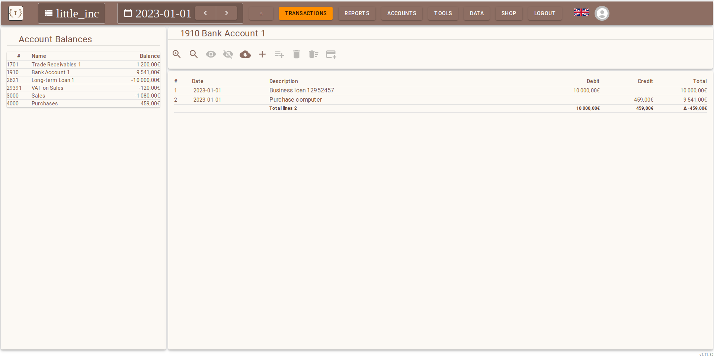

# Tasenor Bookkeeper

This is a monorepo for developing Tasenor Bookkeeper. For the latest published developer documentation, see
[https://docs.stg.tasenor.com/](https://docs.stg.tasenor.com/).

## Content

### Applications

* [Bookkeeper Backend](./apps/bookkeeper-api/README.md) API for Bookkeeper.
* [Bookkeeper UI](./apps/bookkeeper/README.md) UI for Bookkeeper.
* [CLI](./apps/cli/README.md) Command-line API access.

### Databases

* [Databases](./databases/README.md) Development databases.

### Librariers

* [Tasenor Common](./packages/tasenor-common/README.md) Type defintions and tools for both browser and Node.
* [Tasenor Common UI](./packages/tasenor-common-ui/README.md) Shared components for browser.
* [Tasenor Common Node](./packages/tasenor-common-node/README.md) Node libraries for mainly server use.
* [Unit Tests](./unit-tests/README.md) Unit tests and testing utilities.

### Configurations

* [Tasenor Config](./packages/tasenor-config/README.md)

### Turbo Commands

* `turbo audit` Build all buildable packages.
* `turbo build` Build all buildable packages.
* `turbo demo` Launch local demo servers.
* `turbo dev` Launch local development environment.
* `turbo fix` Fix all fixable syntax checks.
* `turbo lint` Syntax check all.
* `turbo test` Run all tests.
* `turbo release` Increase patch level and publish all public NPM packages.
* `turbo show-version` List all versions from published packages.
