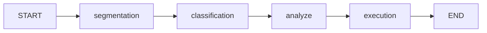

# Overview

This document gives brief overview how the importing is processed.

## Interactive Stateful Process

TODO: Document about interactive processing.

## Stages of Processing

The import processing goes through the following stages:

1. **Segmentation**: Split incoming data to smaller pieces so that parts of the original data are grouped
   together under unique *segmentation ID*. Each group present some meaningful unit of information
   belonging together called *segment*.
2. **Classification**: For each segment, determine which *class* it belongs to. Classes are some
   defined set of qualities describing similar segments.
3. **Analyze**: Based on the classification, additional information can be collected and/or calculated
   for each segment.
4. **Execution**: Once information for each segment is complete, we can execute database insertions,
   REST API calls or whatever appropriate actions based on the segement data.
