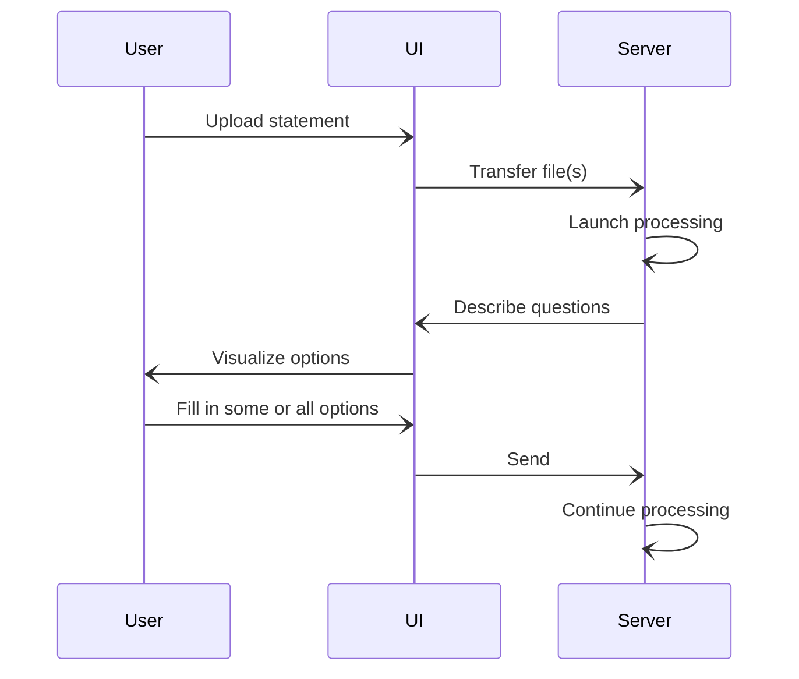
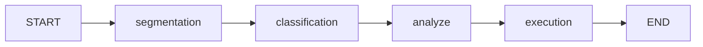

# Overview

Theoretical framework how the importing data is processed.

## Interactive Stateful Process

### Theory
Core of the data import processing is based on the idea we call *interactive stateful process*.
It means a system that uses the following generic principle for processing data:

1. Initial *state* of the *process* is established in the server.
2. Possible *directions* to the next state are detemined by the server.
3. Choose one
   - If there is only one direction, we select that.
   - If there are no directions, the process has *failed*. The process ends.
   - If there are more than one direction, the server asks from the UI which one to select. User may also add
     additional information as specified the direction definition.
4. Apply the direction (with additional information, if any) to the state and produce a new state.
5. Determine if the state is a *final* state. In that case, the process ends.
6. Go back to 2.

### Data Import

In the case of data import, the interpretation of the above is the following: we have various stages of the import
process, which describe the progress we have made. The directions present the possibilities of different configuration
values needed but not yet specified. It mat also present some special handling like skipping some transaction found
from the input statemet.

## Stages of Processing

The import processing itself goes through the following stages:

1. **Segmentation**: Split incoming data to smaller pieces so that parts of the original data are grouped
   together under unique *segmentation ID*. Each group present some meaningful unit of information
   belonging together called *segment*.
2. **Classification**: For each segment, determine which *class* it belongs to. Classes are some
   defined set of qualities describing similar segments.
3. **Analyze**: Based on the classification, additional information can be collected and/or calculated
   for each segment.
4. **Execution**: Once information for each segment is complete, we can execute database insertions,
   REST API calls or whatever appropriate actions based on the segement data.
