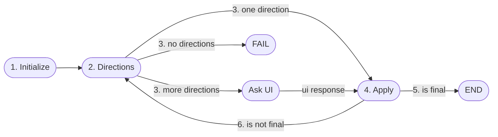
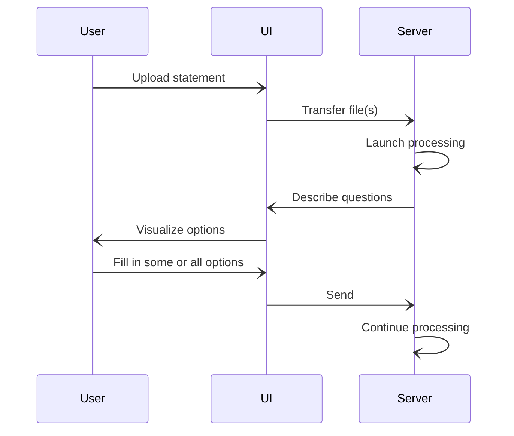
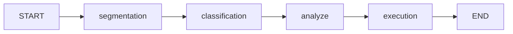

# Overview

Theoretical framework for data import processing.

## Interactive Stateful Process

### Theory
The concept of *interactive stateful process* is the foundation of data import processing. It encompasses the following generic principles of data processing:

1. In the server, the initial *state* of the *process* is established.
2. The server determines the possible *directions* to the next state.
3. Choose one option below:
   - If there is only one direction, select it.
   - If there are no directions, the process has *failed*. The process ends.
   - If there are multiple directions, the server prompts the UI to select one.
     User may also add more information as specified in the direction definition.
4. Apply the direction, along with any additional information, to transform the state into a new state.
5. Determine if the state is a *final* state. If so, the process is complete.
6. Return to Step 2.

### Data Import

Regarding data import, the theory above can be interpreted as follows:
The import process comprises multiple stages that document progress
The directions outline necessary but not yet specified configuration values
Special handling might be required, such as omitting certain transactions from the input statement.

## Stages of Processing

The import processing itself goes through the following stages:

1. **Segmentation**: Split incoming data into smaller pieces and groups them based on a unique *segmentation ID*.
   Each group presents a cohesive unit of information called a *segment*.
2. **Classification**: Specify a class for each segment. Classes are some defined set of qualities describing
   similar segments.
3. **Analyze**: Additional data can be gathered and analyzed for each segment based on its classification.
4. **Execution**: After analyzing the information for each segment, actions such as database insertions,
   REST API calls and others can be executed based on the segment data.
